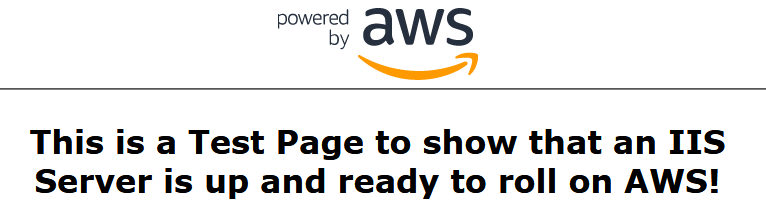
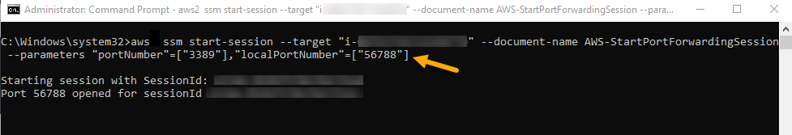
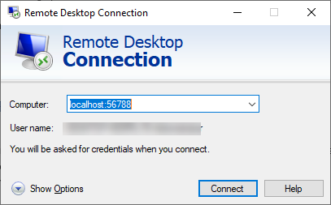
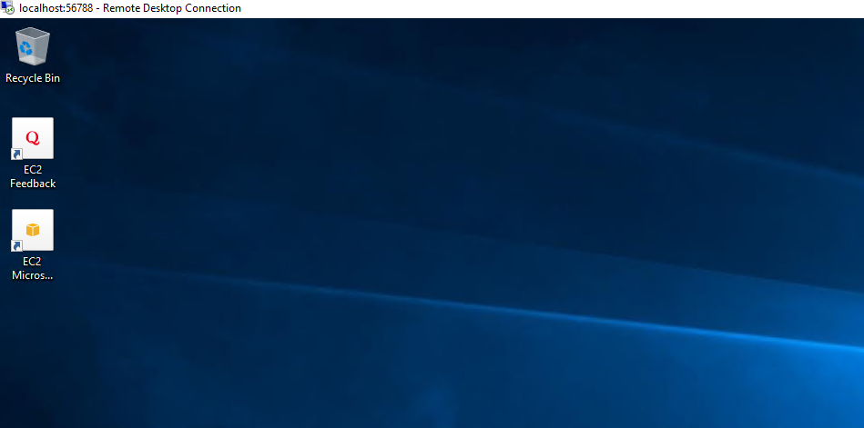

// Add steps as necessary for accessing the software, post-configuration, and testing. Don’t include full usage instructions for your software, but add links to your product documentation for that information.
//Should any sections not be applicable, remove them

=== Testing the deployment
// If steps are required to test the deployment, add them here. If not, remove the heading
:xrefstyle: short
To test the deployment, first ensure that your IP address is entered in the WebAccessCIDR parameter. If so, you can enter the URL of your Elastic Load Balancer (part of the output of the WebAutoScaleStack) in a web browser. The window shown in <<#sample-web-page>> will display.

[#sample-web-page]
.Test page
[link=images/SampleWebPage.png]

NOTE: If you are unable to connect to the test page, review the security groups for the ELBs and verify they have the correct CIDR ranges.

== Using AWS Systems Manager Session Manager

This Quick Start deploys AWS Systems Manager Agent (SSM Agent) on all EC2 instances. With SSM Agent, you can use Remote Desktop Protocol (RDP) to connect to them without the need for an RDP bastion host or opening inbound port 3389 with Session Manager. This section explains the requirements for using this feature and how to connect to an EC2 instance of Windows Server using RDP.

NOTE: See https://docs.aws.amazon.com/systems-manager/latest/userguide/what-is-systems-manager.html[What is Systems Manager?], https://docs.aws.amazon.com/systems-manager/latest/userguide/session-manager.htmlAWS[Systems Manager Session Manager], and https://docs.aws.amazon.com/systems-manager/latest/userguide/prereqs-ssm-agent.html[AWS Systems Manager Agent (SSM Agent)] for more information.

==== Prerequisites
You must complete the following:

 * https://docs.aws.amazon.com/cli/latest/userguide/cli-chap-welcome.html[AWS Command Line Interface] must be installed on your desktop.
 * https://docs.aws.amazon.com/cli/latest/userguide/cli-chap-configure.html#cli-quick-configuration[AWS Command Line Interface (AWS CLI)] must be configured with security credentials for your AWS account.
 * https://docs.aws.amazon.com/systems-manager/latest/userguide/session-manager-working-with-install-plugin.html#install-plugin-windows[Session Manager plugin] for AWS CLI must be installed.

These prerequisites are completed automatically by deploying the Quick Start:

 * SSM Agent must be installed on EC2 instances.*
 * Instance role attached allowing access to Systems Manager API.*

==== Connecting to a Windows instance with RDP

You will first need to start a port forwarding session. Then you would need to open the Remote Desktop Application on your local machine. Using the Remote Desktop application, you will point to the local port of the session, which will forward you on to the Instance.

. Step 1 - Browse to the EC2 Console and note instance-id for the instance you want to connect to.
. Step 2 - Open up the AWS Cli and run the following command, inputting your target instance id after the --target parameter.
[source,bash]
....
aws ssm start-session --target "<your-instance-id>" --document-name AWS-StartPortForwardingSession --parameters "portNumber"=["3389"],"localPortNumber"=["56788"]
....
[#start-session]
.CLI Command to port forward a local port to RDP on an EC2 Instance
[link=images/clisessionmanager.png]

. Step 3 - Once the session is established, open up your RDP application and connect to localhost:56788. You can use any local port number not in use. You will need to provide the appropriate credentials for the windows instances you are logging into.
[#rdp-session]
.RDP to Local Port
[link=images/rdpgraphic.png]

. Step 4 - You will then be logged into the instance, and perform any administrative function you need to.
[#connected-EC2]
.Connected to EC2
[link=images/loggedin.png]

Once you are done you can press Control+C to terminate the session. 
[#disconnected-session]
.Disconnect Session
[link=images/rdp5.png]
image::../images/rdp5.png[RDP,width=100%,height=100%]

== Post deployment steps
If you want to make the Quick Start your own, take a look at the https://github.com/aws-quickstart/quickstart-microsoft-iis/blob/main/templates/automation-parts.template.yaml[automation-parts.template.yaml]. This Cloudformation template uploads all the MOF files that support the Quick Starts as well as creates the Automation Documents that are trigged by the lifecycle hooks of the Auto-Scaling group. The following code block demonstrates a step in the AWS Systems Manager Automation document. These steps under the *main step* section can be added to or modified to support your own Automation steps and configuration. For more information on what you can do in an Automation Document please refer to the https://docs.aws.amazon.com/systems-manager/latest/userguide/automation-actions.html[Systems Manager Automation actions reference]. 
[source,yaml]
....
- name: "setNameTag"
  action: aws:runCommand
  onFailure: "step:abandonHookAction"
  inputs:
    DocumentName: AWS-RunPowerShellScript
    InstanceIds: 
      - "{{InstanceId}}"
    CloudWatchOutputConfig:
      CloudWatchOutputEnabled: "true"
      CloudWatchLogGroupName: "/QuickStart/SetupConfiguration"
    Parameters:
      commands: 
        - |
           Import-Module AWSPowerShell
           $instanceid = (Invoke-RestMethod -Method Get -Uri http://169.254.169.254/latest/meta-data/instance-id)
           New-EC2Tag -Resource $instanceId -Tag @{Key="Name";Value=$env:COMPUTERNAME}
....

== Best practices for using {partner-product-short-name} on AWS
// Provide post-deployment best practices for using the technology on AWS, including considerations such as migrating data, backups, ensuring high performance, high availability, etc. Link to software documentation for detailed information.
For best practice running Windows Workloads on AWS please review https://docs.aws.amazon.com/AWSEC2/latest/WindowsGuide/ec2-best-practices.html[AWS documentation]

For best practice for IIS in Windows please review https://techcommunity.microsoft.com/t5/core-infrastructure-and-security/iis-best-practices/ba-p/1241577[Microsoft Blogs] or https://docs.microsoft.com/en-us/iis/get-started/whats-new-in-iis-10-version-1709/new-features-introduced-in-iis-10-1709[Microsoft Documentation]. 

== Other useful information
//Provide any other information of interest to users, especially focusing on areas where AWS or cloud usage differs from on-premises usage.

This Quick Start launches with Windows Server 2019 Core AMI, the AMI includes the license for Windows Server and is updated on a regular basis with the latest service pack for the operating system. If you would like to modify the Windows Server version please modify the *ImageId* parameter in the asg-lch.template.yaml template in the templates folder. For a list of Windows Images you can run  the following command from the AWS CLI:
[source,bash]
....
aws ssm get-parameters-by-path --path "/aws/service/ami-windows-latest" --region us-east-1
....
